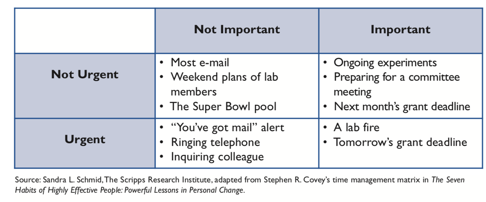

# Zarządzanie czasem

## Cele i perspektywa czasowa

- Cele długoterminowe (3-5 lat)
- Cele średnioterminowe (za pół roku/rok)
- Cele krótkoterminowe (jutro, do końca tygodnia)

## Cele i ich realizacja

- Cele powinny być realistyczne (ta, jasne...)
- Co jakiś czas **reewaluacja**

## Pytania, które warto sobie zadać

- Czas to pieniądz. Czy dobrze go inwestujesz?
- Jak twoja inwestycja ma się do twoich celów długoterminowych?
- Czy na pewno cele średnioterminowe przybliżają cię do realizacji długoterminowych?
- Czy na pewno cele krótkoterminowe przybliżają cię do realizacji średnioterminowych?

## Dobra ma 24 godziny, tydzień 7 dni...

- Nie zdołasz zrobić wszystkiego
- Sukces jest wtedy, kiedy: 
    - robisz rzeczy, na których ci zależy na prawdę dobrze
    - robisz rzeczy, które musisz zrobić
    - masz czas wolny:)
    

    
## Macierz Eisenhowera (chyba)

## Macierz Eisenhowera

## Macierz Eisenhowera

- Rzeczy z lewego-górnego pola najlepiej nie robić wcale/robić w wolnym czasie
- Rzeczy z prawego-dolnego pola nie powinny tam nigdy trafić
- Na rzeczy z lewego-dolnego pola najczęściej nic się nie da poradzić
- Najlepiej realizować rzeczy z prawego-górnego pola

## Zaplanuj czas w swoim projekcie

- Praca pisemna - deadline 30 maj
- Sesja plakatowa - 6 maj

